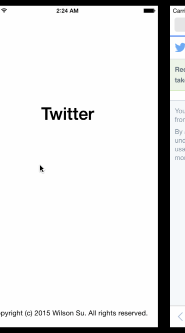

## Twitter [(raw)](https://gist.githubusercontent.com/timothy1ee/b9b1860c8ecb4b0b1c18/raw/2adc3f63677d81644e00245cee891eee88907767/gistfile1.md)

This is a basic twitter app to read and compose tweets the [Twitter API](https://apps.twitter.com/).

Time spent: `18`

### Features

#### Required

- [x] User can sign in using OAuth login flow
- [x] User can view last 20 tweets from their home timeline
- [x] The current signed in user will be persisted across restarts
- [x] In the home timeline, user can view tweet with the user profile picture, username, tweet text, and timestamp.  In other words, design the custom cell with the proper Auto Layout settings.  You will also need to augment the model classes.
- [x] User can pull to refresh
- [x] User can compose a new tweet by tapping on a compose button.
- [x] User can tap on a tweet to view it, with controls to retweet, favorite, and reply.
- [x] User can retweet, favorite, and reply to the tweet directly from the timeline feed.

#### Optional

- [x] When composing, you should have a countdown in the upper right for the tweet limit.
- [ ] After creating a new tweet, a user should be able to view it in the timeline immediately without refetching the timeline from the network.
- [x] Retweeting and favoriting should increment the retweet and favorite count.
- [x] User should be able to unretweet and unfavorite and should decrement the retweet and favorite count.
- [ ] Replies should be prefixed with the username and the reply_id should be set when posting the tweet,
- [x] User can load more tweets once they reach the bottom of the feed using infinite loading similar to the actual Twitter client.

### Walkthrough

# Twitter iOS Application

This is an iOS iPhone Twitter Client that uses OAuth and the Twitter API [Twitter API](https://dev.twitter.com/overview/documentation).  The app can be used to sign into Twitter, tweet, view one's timeline, reply, retweet, and favorite a tweet.

Time spent: 18 hours spent in total

Completed user stories: 

* [x] Dragging anywhere in the view should reveal the menu.
* [x] The menu should include links to your profile, the home timeline, and the mentions view.
* [x] The menu can look similar to the LinkedIn menu below or feel free to take liberty with the UI.
* [x] Contains the user header view
* [x] Contains a section with the users basic stats: # tweets, # following, # followers
* [x] User can compose a new tweet by tapping on a compose button.
* [x] Optional: Implement the paging view for the user description.
* [x] Optional: As the paging view moves, increase the opacity of the background screen. See the actual Twitter app for this effect
* [x] Optional: Pulling down the profile page should blur and resize the header image.
* [ ] Optional: Account switching
* [ ] Optional: Long press on tab bar to bring up Account view with animation
* [ ] Optional: Tap account to switch to
* [ ] Optional: Include a plus button to Add an Account
* [ ] Optional: Swipe to delete an account

References:

* https://dev.twitter.com/overview/documentation
* https://dev.twitter.com/overview/general/image-resources

Walkthrough of all user stories:

GIF created with [LiceCap](http://www.cockos.com/licecap/).